# 🚀 Guide Complet - Stack Technique Moderne

## 📋 Table des Matières

1. [Introduction à Cyber Rage](#cyber-rage)
2. [JavaScript - Le Langage Fondamental](#javascript)
3. [Docker - Conteneurisation](#docker)
4. [MongoDB - Base de Données NoSQL](#mongodb)
5. [Seeders - Initialisation des Données](#seeders)
6. [React - Framework Frontend](#react)
7. [React Native - Applications Mobiles](#react-native)
8. [Architecture Globale](#architecture-globale)

---

## 🎮 Cyber Rage

### Qu'est-ce que Cyber Rage ?

**Cyber Rage** est une application/plateforme qui combine plusieurs technologies modernes pour offrir une expérience utilisateur optimale. Le projet utilise une architecture full-stack JavaScript avec des composants conteneurisés.

### Objectifs du Projet

- 🎯 Performance optimale avec des technologies modernes
- 🔒 Sécurité renforcée avec Docker
- 📱 Support multi-plateforme (Web & Mobile)
- 💾 Gestion efficace des données avec MongoDB

### Architecture Cyber Rage

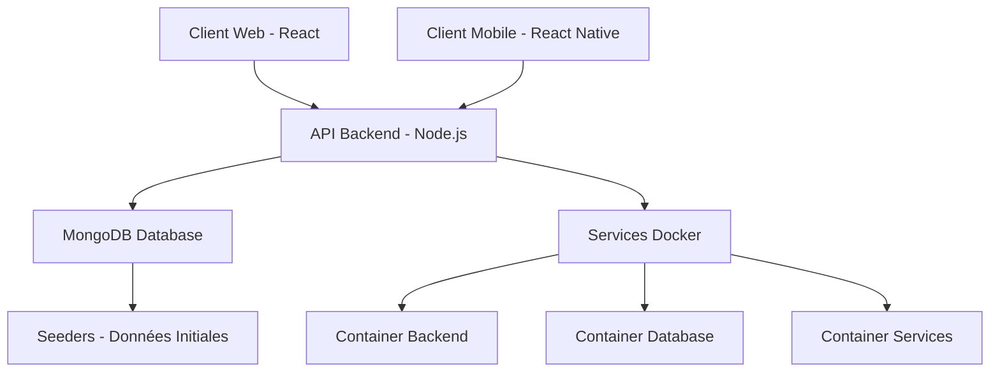

### Tableau Comparatif des Technologies

| Technologie | Rôle | Avantages | Cas d'Usage |
|-------------|------|-----------|-------------|
| **React** | Frontend Web | Virtual DOM, Performance | Interface web responsive |
| **React Native** | Mobile | Code partagé iOS/Android | Applications mobiles natives |
| **Node.js/Express** | Backend API | JavaScript full-stack | API RESTful |
| **MongoDB** | Base de données | Flexible, Scalable | Stockage documents |
| **Docker** | Conteneurisation | Isolation, Portabilité | Déploiement consistant |

---

## 💻 JavaScript

### Introduction

JavaScript est le langage de programmation principal du web moderne. Il permet de créer des applications interactives côté client et côté serveur (avec Node.js).

### Concepts Fondamentaux

#### 1. **Variables et Types de Données**

```javascript
// ES6+ - const et let
const nom = "Cyber Rage";
let score = 0;

// Types primitifs
const string = "texte";
const number = 42;
const boolean = true;
const undefined = undefined;
const null = null;
const symbol = Symbol('unique');
const bigInt = 9007199254740991n;
```

#### 2. **Fonctions Modernes**

```javascript
// Fonction classique
function calculer(a, b) {
    return a + b;
}

// Arrow function
const calculerModerne = (a, b) => a + b;

// Fonction asynchrone
async function fetchData() {
    const response = await fetch('/api/data');
    return response.json();
}
```

#### 3. **Destructuring et Spread**

```javascript
// Destructuring d'objets
const user = { nom: "Alice", age: 25, email: "alice@example.com" };
const { nom, age } = user;

// Destructuring de tableaux
const [premier, second, ...reste] = [1, 2, 3, 4, 5];

// Spread operator
const newUser = { ...user, ville: "Casablanca" };
const newArray = [...reste, 6, 7];
```

### Événements et Callbacks

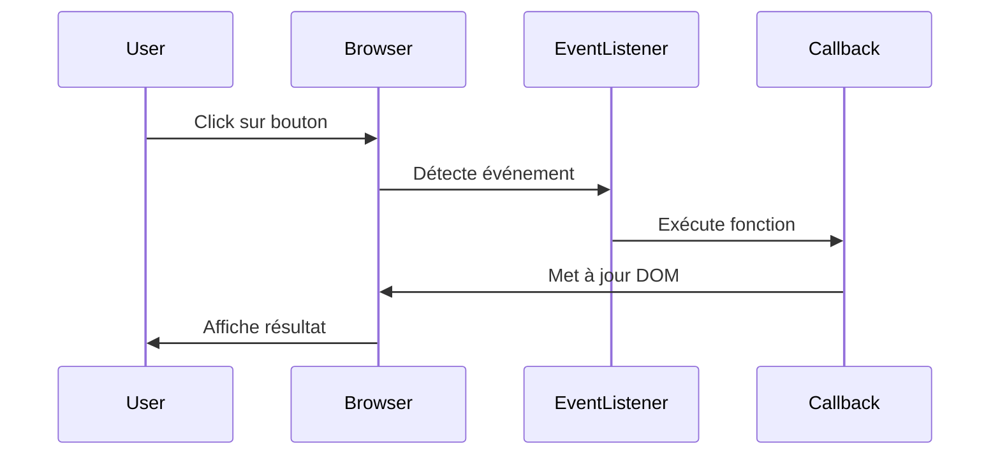

### Promises et Async/Await

```javascript
// Promise traditionnelle
function getUserData(id) {
    return fetch(`/api/users/${id}`)
        .then(response => response.json())
        .then(data => data)
        .catch(error => console.error(error));
}

// Async/Await (moderne)
async function getUserDataModerne(id) {
    try {
        const response = await fetch(`/api/users/${id}`);
        const data = await response.json();
        return data;
    } catch (error) {
        console.error('Erreur:', error);
    }
}
```

### Graphique d'Évolution JavaScript

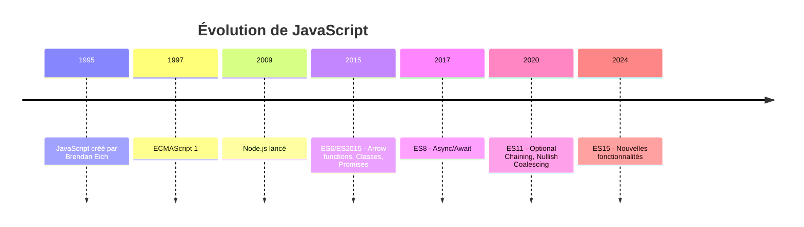

---

## 🐳 Docker

### Qu'est-ce que Docker ?

Docker est une plateforme de conteneurisation qui permet d'empaqueter une application avec toutes ses dépendances dans un conteneur standardisé.

### Architecture Docker

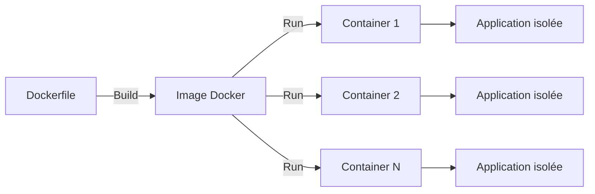

### Concepts Clés

#### 1. **Dockerfile**

```dockerfile
# Image de base
FROM node:18-alpine

# Répertoire de travail
WORKDIR /app

# Copie des fichiers de dépendances
COPY package*.json ./

# Installation des dépendances
RUN npm install

# Copie du code source
COPY . .

# Exposition du port
EXPOSE 3000

# Commande de démarrage
CMD ["npm", "start"]
```

#### 2. **Docker Compose**

```yaml
version: '3.8'

services:
  # Backend API
  backend:
    build: ./backend
    ports:
      - "3000:3000"
    environment:
      - NODE_ENV=production
      - MONGO_URI=mongodb://mongo:27017/cyberrage
    depends_on:
      - mongo
    networks:
      - app-network

  # Base de données MongoDB
  mongo:
    image: mongo:7
    ports:
      - "27017:27017"
    volumes:
      - mongo-data:/data/db
    networks:
      - app-network

  # Frontend React
  frontend:
    build: ./frontend
    ports:
      - "80:80"
    depends_on:
      - backend
    networks:
      - app-network

volumes:
  mongo-data:

networks:
  app-network:
    driver: bridge
```

### Cycle de Vie des Conteneurs

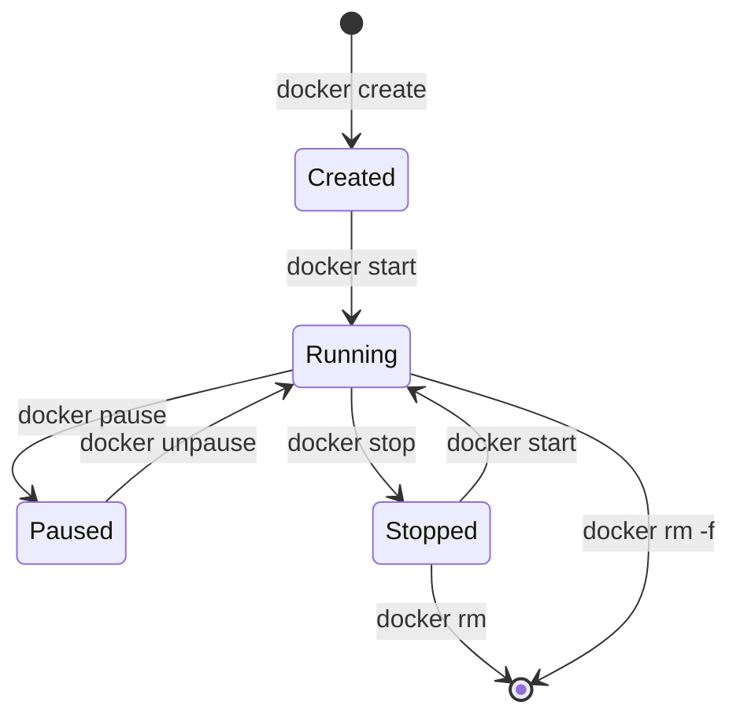

### Comparaison VM vs Docker

| Critère | Machine Virtuelle | Docker Container |
|---------|-------------------|------------------|
| **Taille** | Several GB | Quelques MB |
| **Démarrage** | Minutes | Secondes |
| **Performance** | Overhead significatif | Performance native |
| **Isolation** | Complète (OS complet) | Niveau processus |
| **Portabilité** | Moyenne | Excellente |
| **Utilisation ressources** | Élevée | Faible |

### Commandes Docker Essentielles

```bash
# Construction d'une image
docker build -t cyberrage-backend .

# Lancement d'un conteneur
docker run -d -p 3000:3000 --name backend cyberrage-backend

# Lister les conteneurs
docker ps -a

# Logs d'un conteneur
docker logs backend

# Arrêter un conteneur
docker stop backend

# Supprimer un conteneur
docker rm backend

# Docker Compose
docker-compose up -d
docker-compose down
docker-compose logs -f
```

---

## 🍃 MongoDB

### Introduction

MongoDB est une base de données NoSQL orientée documents. Elle stocke les données au format BSON (Binary JSON), offrant flexibilité et performance.

### Architecture MongoDB

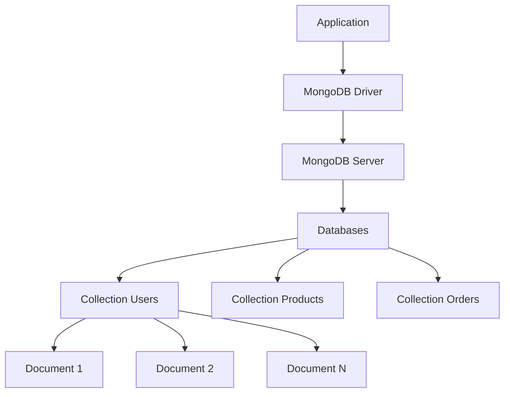

### Modèle de Données

#### Structure d'un Document

```javascript
// Collection: users
{
    "_id": ObjectId("507f1f77bcf86cd799439011"),
    "username": "cyberuser",
    "email": "user@cyberrage.com",
    "profile": {
        "firstName": "Ahmed",
        "lastName": "Benali",
        "avatar": "https://cdn.cyberrage.com/avatars/user.jpg",
        "bio": "Passionné de technologie"
    },
    "scores": [95, 87, 92, 88],
    "badges": ["débutant", "expert", "champion"],
    "createdAt": ISODate("2024-01-15T10:30:00Z"),
    "updatedAt": ISODate("2024-01-28T15:45:00Z"),
    "isActive": true
}
```

### Opérations CRUD

```javascript
// CREATE - Insertion
await db.collection('users').insertOne({
    username: "newuser",
    email: "new@example.com",
    createdAt: new Date()
});

// READ - Lecture
const user = await db.collection('users').findOne({ 
    username: "cyberuser" 
});

const users = await db.collection('users').find({ 
    isActive: true 
}).toArray();

// UPDATE - Mise à jour
await db.collection('users').updateOne(
    { username: "cyberuser" },
    { 
        $set: { "profile.bio": "Nouveau texte" },
        $push: { badges: "nouveau-badge" }
    }
);

// DELETE - Suppression
await db.collection('users').deleteOne({ 
    username: "olduser" 
});
```

### Schéma avec Mongoose

```javascript
const mongoose = require('mongoose');

// Définition du schéma
const userSchema = new mongoose.Schema({
    username: {
        type: String,
        required: true,
        unique: true,
        trim: true,
        minlength: 3
    },
    email: {
        type: String,
        required: true,
        unique: true,
        lowercase: true,
        validate: {
            validator: function(v) {
                return /^\w+([.-]?\w+)*@\w+([.-]?\w+)*(\.\w{2,3})+$/.test(v);
            },
            message: 'Email invalide'
        }
    },
    profile: {
        firstName: String,
        lastName: String,
        avatar: String,
        bio: { type: String, maxlength: 500 }
    },
    scores: [Number],
    badges: [String],
    isActive: { type: Boolean, default: true }
}, {
    timestamps: true  // Ajoute createdAt et updatedAt automatiquement
});

// Création du modèle
const User = mongoose.model('User', userSchema);

module.exports = User;
```

### Indexation et Performance

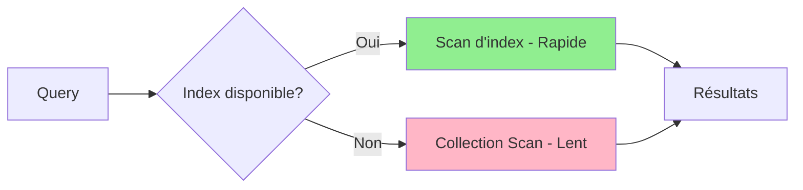

```javascript
// Création d'index
db.collection('users').createIndex({ username: 1 });  // Index ascendant
db.collection('users').createIndex({ email: 1 }, { unique: true });
db.collection('users').createIndex({ "profile.firstName": 1, "profile.lastName": 1 });

// Index composé pour les recherches fréquentes
db.collection('products').createIndex({ category: 1, price: -1 });

// Index texte pour la recherche full-text
db.collection('articles').createIndex({ title: "text", content: "text" });
```

### Agrégation Pipeline

```javascript
// Pipeline d'agrégation complexe
const results = await db.collection('orders').aggregate([
    // Étape 1: Filtrer les commandes de 2024
    { $match: { 
        orderDate: { 
            $gte: new Date('2024-01-01'),
            $lt: new Date('2025-01-01')
        }
    }},
    
    // Étape 2: Grouper par utilisateur
    { $group: {
        _id: '$userId',
        totalOrders: { $sum: 1 },
        totalAmount: { $sum: '$amount' },
        avgAmount: { $avg: '$amount' }
    }},
    
    // Étape 3: Trier par total dépensé
    { $sort: { totalAmount: -1 }},
    
    // Étape 4: Limiter aux 10 meilleurs clients
    { $limit: 10 },
    
    // Étape 5: Joindre avec la collection users
    { $lookup: {
        from: 'users',
        localField: '_id',
        foreignField: '_id',
        as: 'userInfo'
    }}
]).toArray();
```

### Comparaison SQL vs NoSQL

| Aspect | SQL (PostgreSQL) | NoSQL (MongoDB) |
|--------|------------------|-----------------|
| **Modèle** | Tables relationnelles | Documents JSON |
| **Schéma** | Rigide, prédéfini | Flexible, dynamique |
| **Scalabilité** | Verticale (principalement) | Horizontale (sharding) |
| **Transactions** | ACID complètes | ACID depuis v4.0 |
| **Jointures** | Puissantes et complexes | Limitées, utiliser $lookup |
| **Performance** | Excellente pour relations | Excellente pour documents |
| **Cas d'usage** | Finance, ERP | IoT, Big Data, Apps web |

---

## 🌱 Seeders

### Qu'est-ce qu'un Seeder ?

Un **seeder** est un script qui insère des données initiales ou de test dans une base de données. Essentiel pour le développement, les tests et la démonstration.

### Pourquoi Utiliser des Seeders ?

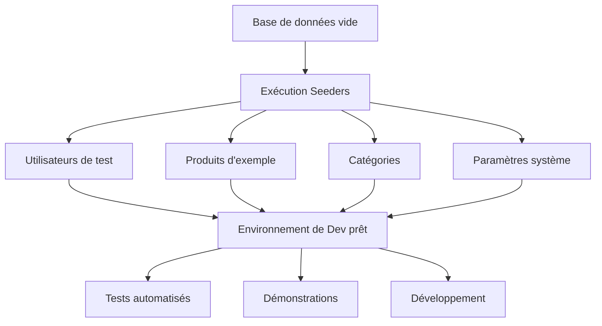

### Avantages des Seeders

- ✅ **Reproductibilité**: Même environnement pour tous les développeurs
- ✅ **Tests**: Données cohérentes pour les tests automatisés
- ✅ **Démonstration**: Interface avec contenu réaliste
- ✅ **Rapidité**: Création rapide d'environnements
- ✅ **Documentation**: Code comme documentation des données

### Implémentation avec MongoDB

#### Structure de Projet

```
seeders/
├── index.js              # Point d'entrée principal
├── users.seeder.js       # Seeder pour utilisateurs
├── products.seeder.js    # Seeder pour produits
├── categories.seeder.js  # Seeder pour catégories
└── helpers/
    └── faker.js          # Génération de données aléatoires
```

#### Seeder Basique

```javascript
// seeders/users.seeder.js
const mongoose = require('mongoose');
const User = require('../models/User');
const bcrypt = require('bcrypt');

const usersData = [
    {
        username: "admin",
        email: "admin@cyberrage.com",
        password: "Admin@123",
        role: "admin",
        profile: {
            firstName: "Super",
            lastName: "Admin",
            bio: "Administrateur système"
        },
        isActive: true
    },
    {
        username: "user1",
        email: "user1@cyberrage.com",
        password: "User@123",
        role: "user",
        profile: {
            firstName: "Ahmed",
            lastName: "Benali",
            bio: "Utilisateur test"
        },
        isActive: true
    },
    {
        username: "user2",
        email: "user2@cyberrage.com",
        password: "User@123",
        role: "user",
        profile: {
            firstName: "Fatima",
            lastName: "Zahra",
            bio: "Développeuse passionnée"
        },
        isActive: true
    }
];

async function seedUsers() {
    try {
        // Nettoyer la collection
        await User.deleteMany({});
        console.log('✓ Collection users nettoyée');
        
        // Hasher les mots de passe
        for (let userData of usersData) {
            userData.password = await bcrypt.hash(userData.password, 10);
        }
        
        // Insérer les utilisateurs
        const users = await User.insertMany(usersData);
        console.log(`✓ ${users.length} utilisateurs créés`);
        
        return users;
    } catch (error) {
        console.error('✗ Erreur lors du seeding des utilisateurs:', error);
        throw error;
    }
}

module.exports = seedUsers;
```

#### Seeder avec Faker.js

```javascript
// seeders/products.seeder.js
const { faker } = require('@faker-js/faker');
const Product = require('../models/Product');

async function seedProducts(count = 50) {
    try {
        await Product.deleteMany({});
        console.log('✓ Collection products nettoyée');
        
        const categories = ['Électronique', 'Vêtements', 'Alimentation', 'Maison', 'Sport'];
        const products = [];
        
        for (let i = 0; i < count; i++) {
            products.push({
                name: faker.commerce.productName(),
                description: faker.commerce.productDescription(),
                price: parseFloat(faker.commerce.price({ min: 10, max: 1000 })),
                category: faker.helpers.arrayElement(categories),
                stock: faker.number.int({ min: 0, max: 100 }),
                images: [
                    faker.image.url({ width: 800, height: 600 }),
                    faker.image.url({ width: 800, height: 600 })
                ],
                rating: faker.number.float({ min: 0, max: 5, precision: 0.1 }),
                reviews: faker.number.int({ min: 0, max: 500 }),
                isAvailable: faker.datatype.boolean(),
                tags: faker.helpers.arrayElements(
                    ['nouveau', 'populaire', 'promo', 'tendance', 'best-seller'],
                    faker.number.int({ min: 1, max: 3 })
                )
            });
        }
        
        const insertedProducts = await Product.insertMany(products);
        console.log(`✓ ${insertedProducts.length} produits créés`);
        
        return insertedProducts;
    } catch (error) {
        console.error('✗ Erreur lors du seeding des produits:', error);
        throw error;
    }
}

module.exports = seedProducts;
```

#### Script Principal de Seeding

```javascript
// seeders/index.js
const mongoose = require('mongoose');
const seedUsers = require('./users.seeder');
const seedProducts = require('./products.seeder');
const seedCategories = require('./categories.seeder');

async function runSeeders() {
    try {
        // Connexion à MongoDB
        await mongoose.connect(process.env.MONGO_URI || 'mongodb://localhost:27017/cyberrage', {
            useNewUrlParser: true,
            useUnifiedTopology: true
        });
        console.log('✓ Connecté à MongoDB');
        
        // Exécution des seeders dans l'ordre
        console.log('\n🌱 Démarrage du seeding...\n');
        
        await seedCategories();
        await seedUsers();
        await seedProducts(100);
        
        console.log('\n✅ Seeding terminé avec succès!\n');
        
    } catch (error) {
        console.error('\n❌ Erreur lors du seeding:', error);
        process.exit(1);
    } finally {
        await mongoose.connection.close();
        console.log('✓ Connexion MongoDB fermée');
        process.exit(0);
    }
}

// Exécution si appelé directement
if (require.main === module) {
    runSeeders();
}

module.exports = runSeeders;
```

#### Utilisation dans package.json

```json
{
  "scripts": {
    "seed": "node seeders/index.js",
    "seed:users": "node seeders/users.seeder.js",
    "seed:products": "node seeders/products.seeder.js",
    "seed:fresh": "npm run db:drop && npm run seed"
  }
}
```

### Workflow des Seeders

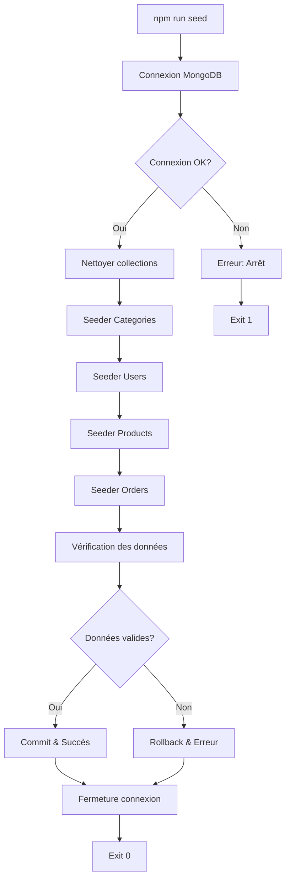

---

## ⚛️ React

### Introduction

React est une bibliothèque JavaScript développée par Facebook pour construire des interfaces utilisateur interactives et performantes.

### Concepts Fondamentaux

#### 1. **Composants**

```javascript
// Composant fonctionnel moderne
import React, { useState, useEffect } from 'react';

function UserProfile({ userId }) {
    const [user, setUser] = useState(null);
    const [loading, setLoading] = useState(true);
    
    useEffect(() => {
        async function fetchUser() {
            try {
                const response = await fetch(`/api/users/${userId}`);
                const data = await response.json();
                setUser(data);
            } catch (error) {
                console.error('Erreur:', error);
            } finally {
                setLoading(false);
            }
        }
        
        fetchUser();
    }, [userId]);
    
    if (loading) return <div>Chargement...</div>;
    if (!user) return <div>Utilisateur non trouvé</div>;
    
    return (
        <div className="user-profile">
            
            <h2>{user.profile.firstName} {user.profile.lastName}</h2>
            <p>@{user.username}</p>
            <p>{user.profile.bio}</p>
        </div>
    );
}

export default UserProfile;
```

#### 2. **Hooks Essentiels**

```javascript
import React, { useState, useEffect, useContext, useCallback, useMemo } from 'react';

function CompleteExample() {
    // useState - Gestion d'état local
    const [count, setCount] = useState(0);
    const [items, setItems] = useState([]);
    
    // useEffect - Effets de bord
    useEffect(() => {
        document.title = `Count: ${count}`;
    }, [count]);
    
    // useCallback - Mémorisation de fonctions
    const handleClick = useCallback(() => {
        setCount(c => c + 1);
    }, []);
    
    // useMemo - Mémorisation de valeurs calculées
    const expensiveValue = useMemo(() => {
        return items.reduce((sum, item) => sum + item.price, 0);
    }, [items]);
    
    // useContext - Consommation de contexte
    const theme = useContext(ThemeContext);
    
    return (
        <div style={{ backgroundColor: theme.bg }}>
            <p>Count: {count}</p>
            <p>Total: {expensiveValue}</p>
            <button onClick={handleClick}>Increment</button>
        </div>
    );
}
```

### Virtual DOM et Réconciliation

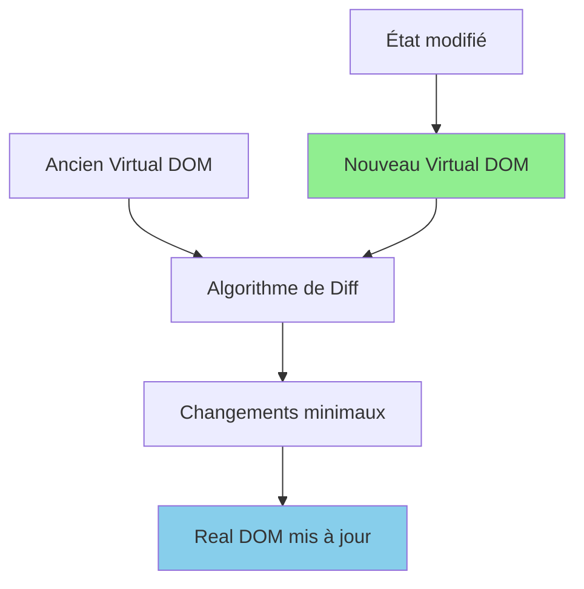

### Architecture d'une Application React

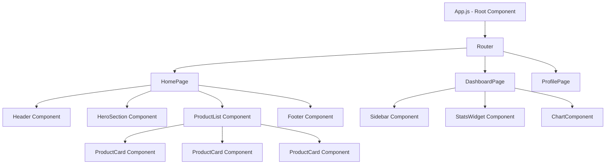

### State Management

```javascript
// Context API pour état global
import React, { createContext, useContext, useReducer } from 'react';

// Définition du contexte
const AppContext = createContext();

// Reducer
function appReducer(state, action) {
    switch (action.type) {
        case 'SET_USER':
            return { ...state, user: action.payload };
        case 'SET_THEME':
            return { ...state, theme: action.payload };
        case 'ADD_TO_CART':
            return {
                ...state,
                cart: [...state.cart, action.payload]
            };
        case 'REMOVE_FROM_CART':
            return {
                ...state,
                cart: state.cart.filter(item => item.id !== action.payload)
            };
        default:
            return state;
    }
}

// Provider
export function AppProvider({ children }) {
    const [state, dispatch] = useReducer(appReducer, {
        user: null,
        theme: 'light',
        cart: []
    });
    
    return (
        <AppContext.Provider value={{ state, dispatch }}>
            {children}
        </AppContext.Provider>
    );
}

// Hook personnalisé
export function useApp() {
    const context = useContext(AppContext);
    if (!context) {
        throw new Error('useApp must be used within AppProvider');
    }
    return context;
}

// Utilisation dans un composant
function CartButton() {
    const { state, dispatch } = useApp();
    
    const addToCart = (product) => {
        dispatch({ type: 'ADD_TO_CART', payload: product });
    };
    
    return (
        <button onClick={() => addToCart(product)}>
            Panier ({state.cart.length})
        </button>
    );
}
```

### Cycle de Vie des Composants

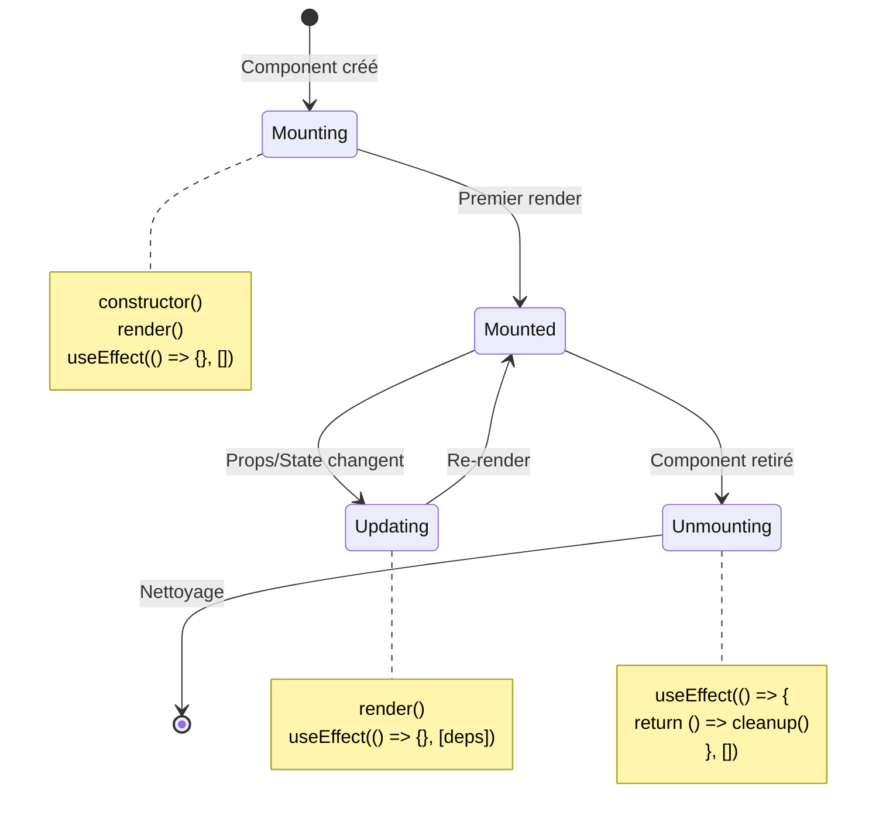

### Routing avec React Router

```javascript
import { BrowserRouter, Routes, Route, Link, Navigate } from 'react-router-dom';

function App() {
    return (
        <BrowserRouter>
            <nav>
                <Link to="/">Accueil</Link>
                <Link to="/products">Produits</Link>
                <Link to="/dashboard">Dashboard</Link>
            </nav>
            
            <Routes>
                <Route path="/" element={<HomePage />} />
                <Route path="/products" element={<ProductsPage />} />
                <Route path="/products/:id" element={<ProductDetail />} />
                <Route path="/dashboard" element={
                    <ProtectedRoute>
                        <Dashboard />
                    </ProtectedRoute>
                } />
                <Route path="*" element={<Navigate to="/" />} />
            </Routes>
        </BrowserRouter>
    );
}

// Route protégée
function ProtectedRoute({ children }) {
    const { state } = useApp();
    return state.user ? children : <Navigate to="/login" />;
}
```

### Performance et Optimisation

| Technique | Description | Utilisation |
|-----------|-------------|-------------|
| **React.memo** | Mémorise le composant | Composants purs, props stables |
| **useMemo** | Mémorise une valeur calculée | Calculs coûteux |
| **useCallback** | Mémorise une fonction | Callbacks passés aux enfants |
| **Code Splitting** | Charge le code à la demande | `React.lazy()` + Suspense |
| **Virtualisation** | Rend uniquement les éléments visibles | Longues listes (react-window) |

```javascript
// Exemple de code splitting
import React, { lazy, Suspense } from 'react';

const HeavyComponent = lazy(() => import('./HeavyComponent'));

function App() {
    return (
        <Suspense fallback={<div>Chargement...</div>}>
            <HeavyComponent />
        </Suspense>
    );
}
```

---

## 📱 React Native

### Introduction

React Native permet de développer des applications mobiles natives pour iOS et Android en utilisant React et JavaScript.

### Différences avec React Web

| Aspect | React (Web) | React Native |
|--------|-------------|--------------|
| **Rendu** | DOM HTML | Composants natifs |
| **Styles** | CSS | StyleSheet (subset CSS) |
| **Navigation** | React Router | React Navigation |
| **Événements** | onClick, onChange | onPress, onChangeText |
| **Layout** | Flexbox + Grid | Flexbox uniquement |
| **Composants** | div, span, button | View, Text, TouchableOpacity |

### Composants de Base

```javascript
import React, { useState } from 'react';
import {
    View,
    Text,
    StyleSheet,
    TouchableOpacity,
    TextInput,
    ScrollView,
    Image,
    FlatList,
    Alert
} from 'react-native';

function LoginScreen() {
    const [email, setEmail] = useState('');
    const [password, setPassword] = useState('');
    const [loading, setLoading] = useState(false);
    
    const handleLogin = async () => {
        if (!email || !password) {
            Alert.alert('Erreur', 'Veuillez remplir tous les champs');
            return;
        }
        
        setLoading(true);
        try {
            const response = await fetch('https://api.cyberrage.com/auth/login', {
                method: 'POST',
                headers: { 'Content-Type': 'application/json' },
                body: JSON.stringify({ email, password })
            });
            
            const data = await response.json();
            
            if (response.ok) {
                Alert.alert('Succès', 'Connexion réussie!');
                // Navigation vers l'écran principal
            } else {
                Alert.alert('Erreur', data.message);
            }
        } catch (error) {
            Alert.alert('Erreur', 'Problème de connexion');
        } finally {
            setLoading(false);
        }
    };
    
    return (
        <View style={styles.container}>
            <Image 
                source={require('./assets/logo.png')} 
                style={styles.logo}
            />
            
            <Text style={styles.title}>Connexion à Cyber Rage</Text>
            
            <TextInput
                style={styles.input}
                placeholder="Email"
                value={email}
                onChangeText={setEmail}
                keyboardType="email-address"
                autoCapitalize="none"
            />
            
            <TextInput
                style={styles.input}
                placeholder="Mot de passe"
                value={password}
                onChangeText={setPassword}
                secureTextEntry
            />
            
            <TouchableOpacity 
                style={styles.button}
                onPress={handleLogin}
                disabled={loading}
            >
                <Text style={styles.buttonText}>
                    {loading ? 'Connexion...' : 'Se connecter'}
                </Text>
            </TouchableOpacity>
        </View>
    );
}

const styles = StyleSheet.create({
    container: {
        flex: 1,
        justifyContent: 'center',
        alignItems: 'center',
        padding: 20,
        backgroundColor: '#f5f5f5'
    },
    logo: {
        width: 120,
        height: 120,
        marginBottom: 30
    },
    title: {
        fontSize: 24,
        fontWeight: 'bold',
        marginBottom: 30,
        color: '#333'
    },
    input: {
        width: '100%',
        height: 50,
        backgroundColor: 'white',
        borderRadius: 8,
        paddingHorizontal: 15,
        marginBottom: 15,
        borderWidth: 1,
        borderColor: '#ddd'
    },
    button: {
        width: '100%',
        height: 50,
        backgroundColor: '#007AFF',
        borderRadius: 8,
        justifyContent: 'center',
        alignItems: 'center',
        marginTop: 10
    },
    buttonText: {
        color: 'white',
        fontSize: 16,
        fontWeight: 'bold'
    }
});

export default LoginScreen;
```

### Navigation

```javascript
// App.js avec React Navigation
import React from 'react';
import { NavigationContainer } from '@react-navigation/native';
import { createNativeStackNavigator } from '@react-navigation/native-stack';
import { createBottomTabNavigator } from '@react-navigation/bottom-tabs';
import Icon from 'react-native-vector-icons/Ionicons';

const Stack = createNativeStackNavigator();
const Tab = createBottomTabNavigator();

// Tab Navigator
function MainTabs() {
    return (
        <Tab.Navigator
            screenOptions={({ route }) => ({
                tabBarIcon: ({ focused, color, size }) => {
                    let iconName;
                    
                    if (route.name === 'Home') {
                        iconName = focused ? 'home' : 'home-outline';
                    } else if (route.name === 'Search') {
                        iconName = focused ? 'search' : 'search-outline';
                    } else if (route.name === 'Profile') {
                        iconName = focused ? 'person' : 'person-outline';
                    }
                    
                    return <Icon name={iconName} size={size} color={color} />;
                },
                tabBarActiveTintColor: '#007AFF',
                tabBarInactiveTintColor: 'gray',
            })}
        >
            <Tab.Screen name="Home" component={HomeScreen} />
            <Tab.Screen name="Search" component={SearchScreen} />
            <Tab.Screen name="Profile" component={ProfileScreen} />
        </Tab.Navigator>
    );
}

// Stack Navigator principal
function App() {
    return (
        <NavigationContainer>
            <Stack.Navigator>
                <Stack.Screen 
                    name="Login" 
                    component={LoginScreen}
                    options={{ headerShown: false }}
                />
                <Stack.Screen 
                    name="Main" 
                    component={MainTabs}
                    options={{ headerShown: false }}
                />
                <Stack.Screen 
                    name="Details" 
                    component={DetailsScreen}
                    options={{ title: 'Détails' }}
                />
            </Stack.Navigator>
        </NavigationContainer>
    );
}

export default App;
```

### Architecture React Native

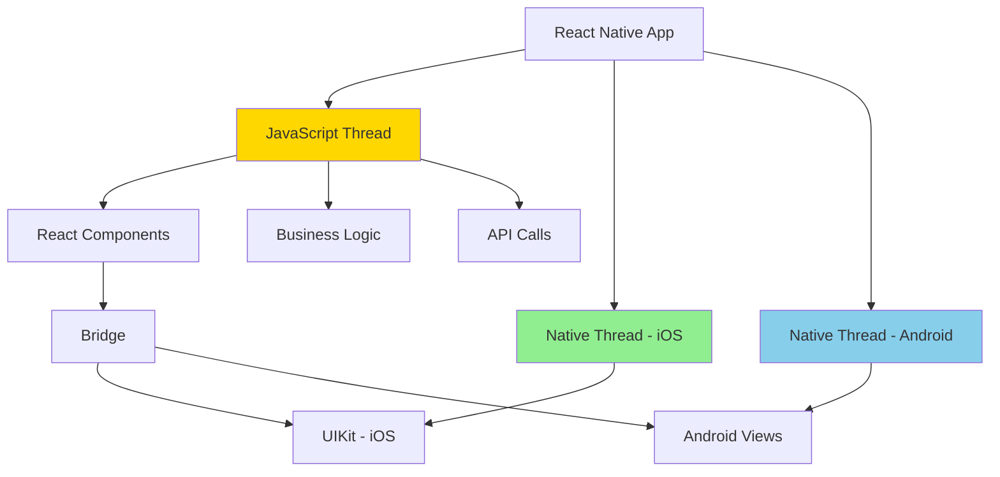

### FlatList pour Listes Performantes

```javascript
import React from 'react';
import { FlatList, View, Text, StyleSheet, Image } from 'react-native';

function ProductList({ products }) {
    const renderProduct = ({ item }) => (
        <View style={styles.productCard}>
            <Image 
                source={{ uri: item.image }} 
                style={styles.productImage}
            />
            <View style={styles.productInfo}>
                <Text style={styles.productName}>{item.name}</Text>
                <Text style={styles.productPrice}>{item.price} MAD</Text>
                <Text style={styles.productDescription} numberOfLines={2}>
                    {item.description}
                </Text>
            </View>
        </View>
    );
    
    return (
        <FlatList
            data={products}
            renderItem={renderProduct}
            keyExtractor={item => item.id.toString()}
            numColumns={2}
            contentContainerStyle={styles.listContainer}
            showsVerticalScrollIndicator={false}
            // Performance optimizations
            removeClippedSubviews={true}
            maxToRenderPerBatch={10}
            updateCellsBatchingPeriod={50}
            initialNumToRender={10}
            windowSize={10}
        />
    );
}

const styles = StyleSheet.create({
    listContainer: {
        padding: 10
    },
    productCard: {
        flex: 1,
        margin: 5,
        backgroundColor: 'white',
        borderRadius: 10,
        overflow: 'hidden',
        elevation: 3,
        shadowColor: '#000',
        shadowOffset: { width: 0, height: 2 },
        shadowOpacity: 0.1,
        shadowRadius: 4
    },
    productImage: {
        width: '100%',
        height: 150,
        resizeMode: 'cover'
    },
    productInfo: {
        padding: 10
    },
    productName: {
        fontSize: 16,
        fontWeight: 'bold',
        marginBottom: 5
    },
    productPrice: {
        fontSize: 18,
        color: '#007AFF',
        fontWeight: 'bold',
        marginBottom: 5
    },
    productDescription: {
        fontSize: 12,
        color: '#666'
    }
});
```

### Gestion d'État avec Redux Toolkit

```javascript
// store/productsSlice.js
import { createSlice, createAsyncThunk } from '@reduxjs/toolkit';

// Action asynchrone
export const fetchProducts = createAsyncThunk(
    'products/fetchProducts',
    async () => {
        const response = await fetch('https://api.cyberrage.com/products');
        return response.json();
    }
);

const productsSlice = createSlice({
    name: 'products',
    initialState: {
        items: [],
        loading: false,
        error: null
    },
    reducers: {
        addProduct: (state, action) => {
            state.items.push(action.payload);
        },
        removeProduct: (state, action) => {
            state.items = state.items.filter(p => p.id !== action.payload);
        }
    },
    extraReducers: (builder) => {
        builder
            .addCase(fetchProducts.pending, (state) => {
                state.loading = true;
            })
            .addCase(fetchProducts.fulfilled, (state, action) => {
                state.loading = false;
                state.items = action.payload;
            })
            .addCase(fetchProducts.rejected, (state, action) => {
                state.loading = false;
                state.error = action.error.message;
            });
    }
});

export const { addProduct, removeProduct } = productsSlice.actions;
export default productsSlice.reducer;

// store/index.js
import { configureStore } from '@reduxjs/toolkit';
import productsReducer from './productsSlice';

export const store = configureStore({
    reducer: {
        products: productsReducer
    }
});

// App.js
import { Provider } from 'react-redux';
import { store } from './store';

function App() {
    return (
        <Provider store={store}>
            <MainApp />
        </Provider>
    );
}
```

### APIs Natives

```javascript
import React, { useState, useEffect } from 'react';
import {
    View,
    Text,
    Button,
    Platform,
    Alert,
    PermissionsAndroid
} from 'react-native';
import * as Location from 'expo-location';
import * as Camera from 'expo-camera';
import AsyncStorage from '@react-native-async-storage/async-storage';

function NativeAPIsExample() {
    const [location, setLocation] = useState(null);
    
    // Géolocalisation
    useEffect(() => {
        (async () => {
            let { status } = await Location.requestForegroundPermissionsAsync();
            if (status !== 'granted') {
                Alert.alert('Permission refusée', 'Impossible d\'accéder à la localisation');
                return;
            }
            
            let location = await Location.getCurrentPositionAsync({});
            setLocation(location);
        })();
    }, []);
    
    // Stockage local
    const saveData = async (key, value) => {
        try {
            await AsyncStorage.setItem(key, JSON.stringify(value));
            Alert.alert('Succès', 'Données sauvegardées');
        } catch (error) {
            Alert.alert('Erreur', 'Impossible de sauvegarder');
        }
    };
    
    const loadData = async (key) => {
        try {
            const value = await AsyncStorage.getItem(key);
            return value != null ? JSON.parse(value) : null;
        } catch (error) {
            Alert.alert('Erreur', 'Impossible de charger');
            return null;
        }
    };
    
    // Caméra
    const takePicture = async () => {
        const { status } = await Camera.requestCameraPermissionsAsync();
        if (status === 'granted') {
            // Ouvrir la caméra
        }
    };
    
    return (
        <View style={{ padding: 20 }}>
            <Text>Latitude: {location?.coords.latitude}</Text>
            <Text>Longitude: {location?.coords.longitude}</Text>
            <Button title="Prendre une photo" onPress={takePicture} />
            <Button title="Sauvegarder" onPress={() => saveData('user', { name: 'Test' })} />
        </View>
    );
}
```

### Workflow de Build

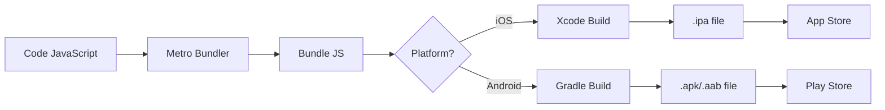

---

## 🏗️ Architecture Globale

### Stack Technique Complète

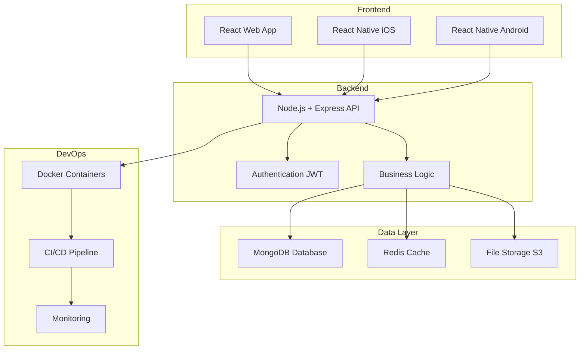

### Flux de Données

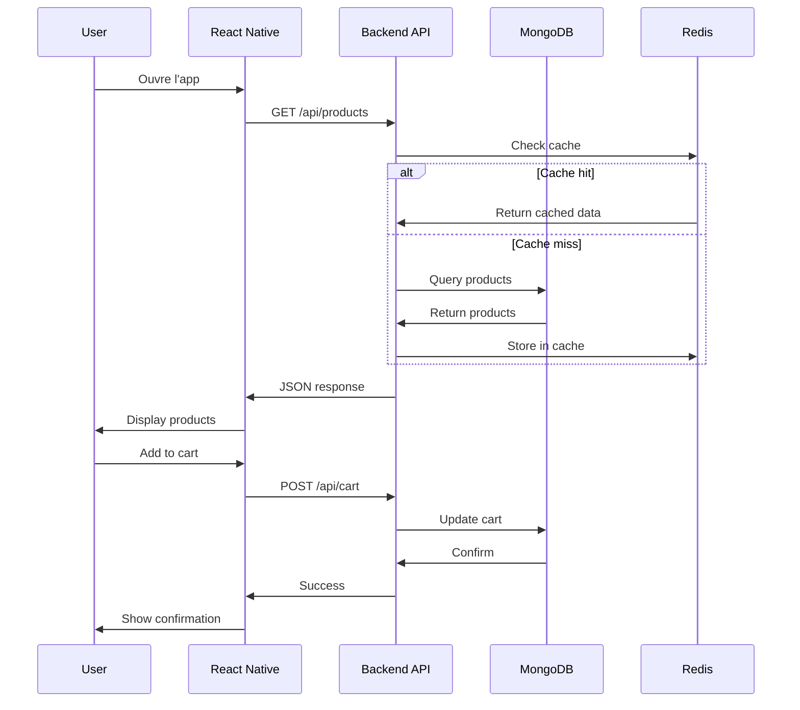

### Structure de Projet Complète

```
cyber-rage/
├── backend/
│   ├── src/
│   │   ├── config/
│   │   │   ├── database.js
│   │   │   └── environment.js
│   │   ├── models/
│   │   │   ├── User.js
│   │   │   ├── Product.js
│   │   │   └── Order.js
│   │   ├── controllers/
│   │   │   ├── authController.js
│   │   │   ├── userController.js
│   │   │   └── productController.js
│   │   ├── routes/
│   │   │   ├── auth.routes.js
│   │   │   ├── user.routes.js
│   │   │   └── product.routes.js
│   │   ├── middleware/
│   │   │   ├── auth.middleware.js
│   │   │   └── error.middleware.js
│   │   ├── services/
│   │   │   ├── emailService.js
│   │   │   └── uploadService.js
│   │   └── utils/
│   │       ├── validators.js
│   │       └── helpers.js
│   ├── seeders/
│   │   ├── index.js
│   │   ├── users.seeder.js
│   │   └── products.seeder.js
│   ├── tests/
│   ├── Dockerfile
│   ├── package.json
│   └── .env.example
│
├── frontend-web/
│   ├── src/
│   │   ├── components/
│   │   │   ├── common/
│   │   │   │   ├── Button.jsx
│   │   │   │   ├── Input.jsx
│   │   │   │   └── Card.jsx
│   │   │   ├── layout/
│   │   │   │   ├── Header.jsx
│   │   │   │   ├── Footer.jsx
│   │   │   │   └── Sidebar.jsx
│   │   │   └── features/
│   │   │       ├── ProductCard.jsx
│   │   │       └── UserProfile.jsx
│   │   ├── pages/
│   │   │   ├── HomePage.jsx
│   │   │   ├── ProductsPage.jsx
│   │   │   └── DashboardPage.jsx
│   │   ├── hooks/
│   │   │   ├── useAuth.js
│   │   │   └── useProducts.js
│   │   ├── context/
│   │   │   └── AppContext.js
│   │   ├── services/
│   │   │   └── api.js
│   │   ├── utils/
│   │   │   └── helpers.js
│   │   ├── App.jsx
│   │   └── main.jsx
│   ├── public/
│   ├── Dockerfile
│   └── package.json
│
├── mobile/
│   ├── src/
│   │   ├── screens/
│   │   │   ├── HomeScreen.js
│   │   │   ├── LoginScreen.js
│   │   │   └── ProfileScreen.js
│   │   ├── components/
│   │   │   ├── Button.js
│   │   │   └── Card.js
│   │   ├── navigation/
│   │   │   └── AppNavigator.js
│   │   ├── store/
│   │   │   ├── store.js
│   │   │   └── slices/
│   │   ├── services/
│   │   │   └── api.js
│   │   └── utils/
│   ├── assets/
│   ├── App.js
│   └── package.json
│
├── docker-compose.yml
├── .gitignore
└── README.md
```

### Pipeline CI/CD

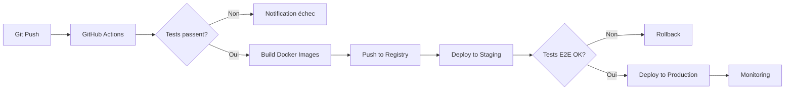

### Tableau des Technologies

| Couche | Technologie | Version | Rôle |
|--------|-------------|---------|------|
| **Frontend Web** | React | 18.x | Interface utilisateur web |
| **Frontend Mobile** | React Native | 0.73.x | Applications iOS/Android |
| **Backend** | Node.js + Express | 20.x / 4.x | API REST |
| **Base de données** | MongoDB | 7.x | Stockage principal |
| **Cache** | Redis | 7.x | Cache et sessions |
| **Conteneurisation** | Docker | 24.x | Isolation et déploiement |
| **Orchestration** | Docker Compose | 2.x | Multi-containers |
| **State Management** | Redux Toolkit | 2.x | État global |
| **Navigation** | React Navigation | 6.x | Navigation mobile |
| **Validation** | Joi | 17.x | Validation données |
| **Tests** | Jest + RTL | Latest | Tests unitaires |
| **CI/CD** | GitHub Actions | - | Intégration continue |

### Métriques de Performance

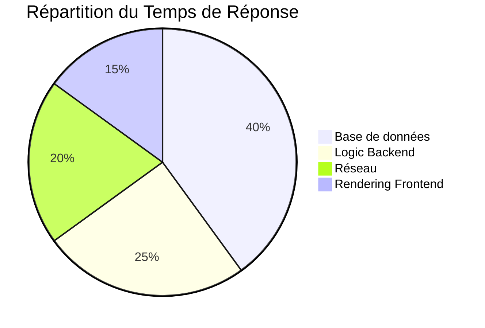

### Checklist de Déploiement

- ✅ Variables d'environnement configurées
- ✅ Base de données seedée avec données initiales
- ✅ Tests unitaires passent (couverture > 80%)
- ✅ Tests d'intégration passent
- ✅ Images Docker optimisées (< 500MB)
- ✅ SSL/TLS configuré
- ✅ CORS configuré correctement
- ✅ Rate limiting activé
- ✅ Logging centralisé
- ✅ Monitoring et alertes configurés
- ✅ Backup automatique configuré
- ✅ Documentation API à jour

---

## 📊 Comparaisons et Benchmarks

### Performance des Frameworks

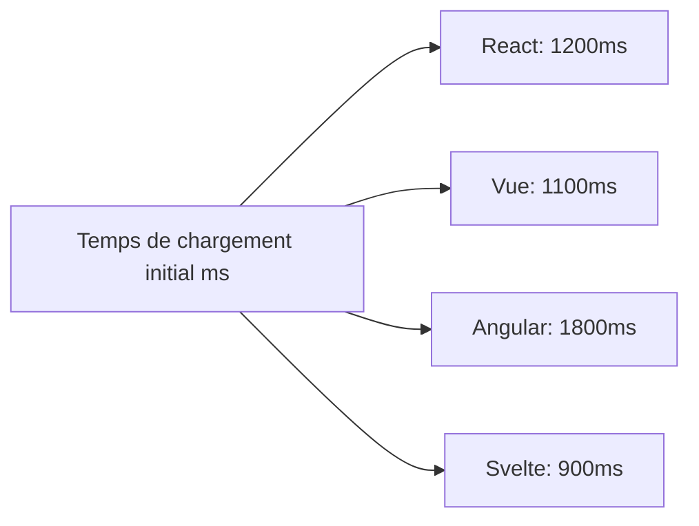

### Complexité d'Apprentissage

| Framework | Courbe d'apprentissage | Écosystème | Communauté |
|-----------|------------------------|------------|------------|
| React | ⭐⭐⭐ Moyenne | ⭐⭐⭐⭐⭐ Très large | ⭐⭐⭐⭐⭐ Énorme |
| React Native | ⭐⭐⭐⭐ Élevée | ⭐⭐⭐⭐ Large | ⭐⭐⭐⭐ Grande |
| Node.js | ⭐⭐ Facile | ⭐⭐⭐⭐⭐ Très large | ⭐⭐⭐⭐⭐ Énorme |
| MongoDB | ⭐⭐ Facile | ⭐⭐⭐⭐ Large | ⭐⭐⭐⭐ Grande |
| Docker | ⭐⭐⭐ Moyenne | ⭐⭐⭐⭐ Large | ⭐⭐⭐⭐⭐ Énorme |

---

## 🎓 Bonnes Pratiques

### Code Quality

1. **Naming Conventions**
   - Variables: `camelCase`
   - Composants: `PascalCase`
   - Constantes: `UPPER_SNAKE_CASE`
   - Fichiers: `kebab-case.js` ou `PascalCase.jsx`

2. **Structure des Fichiers**
   - Un composant par fichier
   - Grouper par fonctionnalité, pas par type
   - Dossier `__tests__` à côté du code

3. **Documentation**
   - JSDoc pour les fonctions complexes
   - README dans chaque module
   - Commentaires pour la logique métier

### Sécurité

- ✅ Valider toutes les entrées utilisateur
- ✅ Utiliser HTTPS uniquement
- ✅ Implémenter rate limiting
- ✅ Stocker les secrets dans variables d'environnement
- ✅ Hasher les mots de passe (bcrypt)
- ✅ Utiliser JWT avec expiration courte
- ✅ Sanitiser les données avant insertion DB
- ✅ Implémenter CORS strictement
- ✅ Logs sans données sensibles

### Performance

- ⚡ Lazy loading des composants
- ⚡ Optimisation des images (WebP, lazy)
- ⚡ Code splitting
- ⚡ Caching avec Redis
- ⚡ Compression gzip/brotli
- ⚡ CDN pour assets statiques
- ⚡ Indexation MongoDB appropriée
- ⚡ Pagination des listes longues

---

## 📚 Ressources

### Documentation Officielle

- **React**: https://react.dev
- **React Native**: https://reactnative.dev
- **Node.js**: https://nodejs.org
- **MongoDB**: https://docs.mongodb.com
- **Docker**: https://docs.docker.com
- **Express**: https://expressjs.com

### Outils Recommandés

- **IDE**: VS Code avec extensions ESLint, Prettier
- **API Testing**: Postman, Insomnia
- **DB Management**: MongoDB Compass, Studio 3T
- **Version Control**: Git + GitHub/GitLab
- **CI/CD**: GitHub Actions, Jenkins, GitLab CI

### Communautés

- Discord React
- Stack Overflow
- Reddit r/reactjs, r/reactnative
- Dev.to
- GitHub Discussions

---

## 🚀 Commandes Rapides

### Backend

```bash
# Installation
npm install

# Développement
npm run dev

# Production
npm start

# Seeders
npm run seed

# Tests
npm test
```

### Frontend Web

```bash
# Installation
npm install

# Développement
npm run dev

# Build production
npm run build

# Preview
npm run preview
```

### Mobile

```bash
# Installation
npm install

# iOS
npm run ios

# Android
npm run android

# Start Metro
npm start
```

### Docker

```bash
# Build et démarrage
docker-compose up -d

# Logs
docker-compose logs -f

# Arrêt
docker-compose down

# Rebuild
docker-compose up -d --build
```

---

## 📝 Conclusion

Ce guide couvre les technologies essentielles pour développer **Cyber Rage** et des applications modernes full-stack. La combinaison de JavaScript, React, React Native, MongoDB et Docker offre:

✅ **Productivité**: Même langage front/back  
✅ **Performance**: Technologies optimisées  
✅ **Scalabilité**: Architecture modulaire  
✅ **Maintenabilité**: Code structuré et testé  
✅ **Portabilité**: Docker pour déploiement facile

---

**Version**: 2.0.3  
**Dernière mise à jour**: Janvier 2026  
**Auteur**: SAFAA FARAJI
**Licence**: MIT
