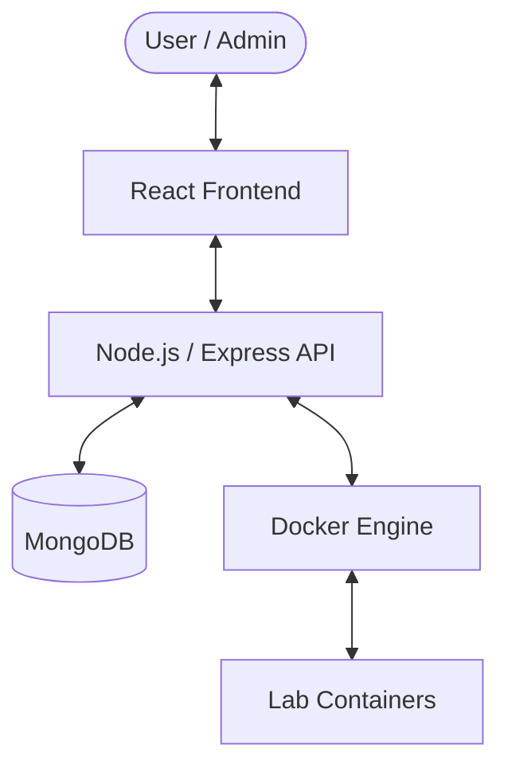
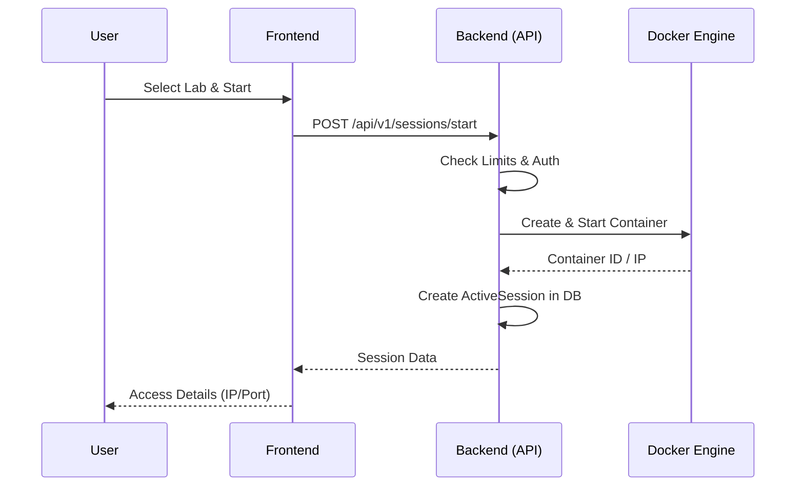

# Deep Cyber - Interactive Cyber Range Platform

## 🐳 Lab Deployment
To enable the laboratories, you must build the local images first. Run the following command from the `cyber-range-backend` directory:
```bash
./scripts/build-labs.sh
```
This will create all necessary containers (`sqli`, `xss`, `telnet`, etc.) locally.

Deep Cyber is a modern, high-performance Cyber Range platform designed for training and practicing cybersecurity vulnerabilities in isolated, containerized environments.

## 🌟 Key Features

- **On-Demand Lab Deployment**: Launch isolated Docker-based labs with a single click.
- **Interactive Flags**: Submit flags to validate and earn points.
- **Admin Console**: Full management of users, labs, and active sessions.
- **Real-time Monitoring**: Track active containers and system performance.
- **Modern UI**: Dark-themed, cyber-neon aesthetics built with React.

---

## 🏗️ System Architecture

### High-Level Flow


### Lab Deployment Sequence


---

## 🚀 Getting Started

### Prerequisites
- [Node.js](https://nodejs.org/) (v16+)
- [Docker Desktop](https://www.docker.com/products/docker-desktop/) (Started)
- [MongoDB](https://www.mongodb.com/try/download/community) (Local or Atlas)

### Local Setup

1. **Clone the repository**
   ```bash
   git clone <repository-url>
   cd cyber_rang
   ```

2. **Configure Backend**
   ```bash
   cd cyber-range-backend
   # Create .env file with MONGO_URI, JWT_SECRET, etc.
   npm install
   npm run seed # Initial data injection
   npm run dev
   ```

3. **Configure Frontend**
   ```bash
   cd cyber-range-frontend
   npm install
   npm run dev
   ```

---

## 🛠️ Creator's Guide: Adding a Lab

Users can contribute by adding new labs through the dedicated interface:

1. **Navigate to Lab Catalog**.
2. **Click "Create Lab"** (Admin or Authorized User).
3. **Configuration**:
   - **Docker Image**: Use a valid tag from Docker Hub (e.g., `vulnerable/sql-injection`).
   - **Flag**: Set the secret string `{FLAG-...}`.
   - **Points**: Assign weight based on difficulty.
4. **Validation**: The backend will ensure the image is pullable before activation.

---

## 🔒 Security & Isolation
Each lab session is strictly isolated:
- **Ephemeral Containers**: Data is wiped after session stop.
- **JWT Protection**: All core actions require signed tokens.
- **RBAC**: Administrative actions (Emergency Stop, User Delete) restricted to Admin role.

---

## 📜 API Reference
Interactive documentation is available at:
`http://localhost:3000/api/v1/docs` (Swagger UI)
# demo_cyber
